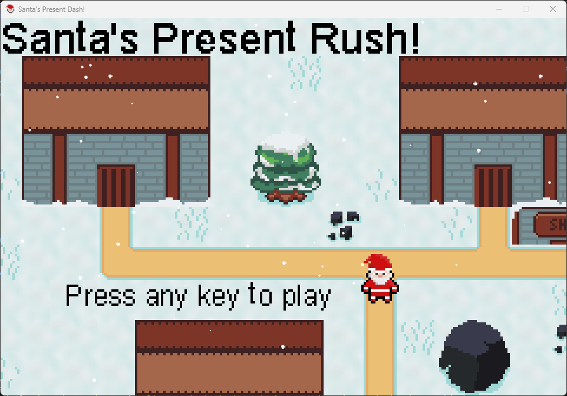

# Santa Dash

Santa Dash is a festive, top-down arcade game where you control Santa as he dashes through snowy levels, collects presents, and spreads holiday cheer! The game features animated sprites, cheerful music, and fun sound effects to create a joyful Christmas experience.

## Features

- Play as Santa with animated walking and death sequences
- Collect presents and avoid obstacles
- Confetti and snow particle effects
- Multiple sound effects and Christmas-themed music
- Tile-based levels with sleighs, tiles, and interactive objects
- Intuitive UI with festive overlays and icons



## Installation

1. **Requirements**:

   - Python 3.12 or newer
   - [pygame](https://www.pygame.org/) library
   - [pytmx](https://github.com/bitcraft/pytmx) library

2. **Install dependencies**:  
   Open PowerShell and run:

   ```
   pip install pygame pytmx
   ```

3. **Run the game**:
   ```
   python main.py
   ```

## Project Structure

```
main.py                # Entry point
assets/                # Game assets (graphics, sounds, fonts, tilemaps)
game/                  # Game logic and modules
```

- **assets/**: Contains all images, sounds, fonts, and tilemaps used in the game.
- **game/**: Contains Python modules for player, levels, UI, sound, animations, and more.

## Controls

- Arrow keys: Move Santa
- Other controls may be shown in-game

## Credits

- Sprites, music, and sound effects are included in the `assets/` folder.
- Developed by gmnate6

## License

This project is for educational and personal use. Please credit the author if you share or modify the game.
